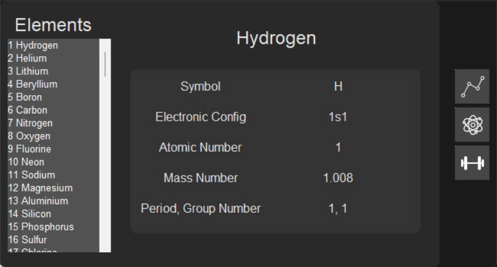
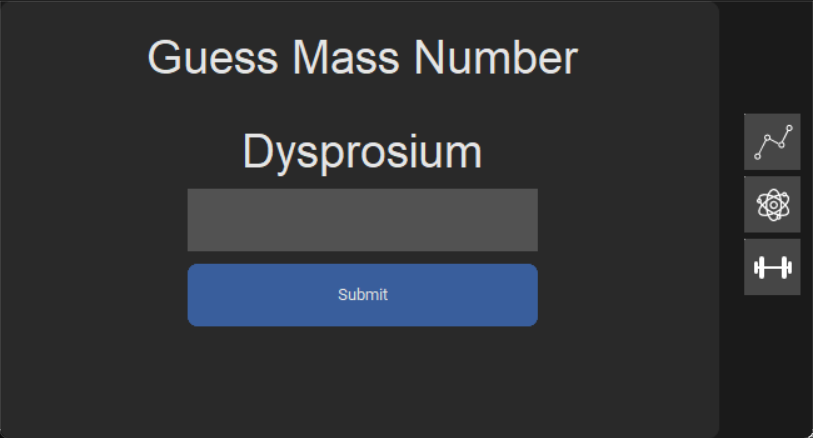

# Atno

##  Use this and never fail in Chemistry every again!*

### Features

Learn things about the Periodic Table.

Test your newly-acquired knowledge with quizes.

### How To Use
The Three Buttons on the right are used to navigate through the three tabs
- First one is Learning where you can learn about elements and stuff
- Second one is where you can test your Atomic number knowledge
- Third one is where you can test your Atomic mass knowledge 

### Contributors 

* [Natya Vidhan Biswas (AKA studiousgamer)](https://github.com/studiousgamer)
* [Shirsak Majumder (AKA mash AKA failure)](https://github.com/dotmashrc)
* [Aargh Rai (AKA FloatingComet62)](https://github.com/FloatingComet62)

*Terms and Conditions apply. We do not account for your idiocy.